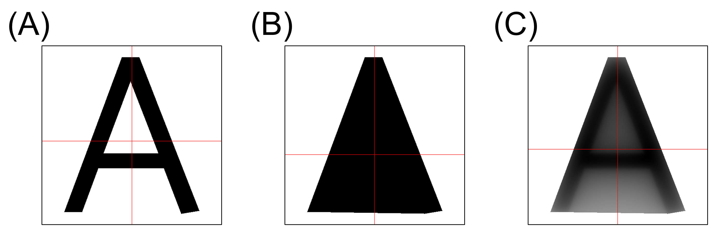

## Summary

The `coglyphr` package provides tools to compute the center of gravity (COG) of character-like binary images using three distinct methods: stroke-based, contour-based, and potential energy-based. These methods capture different aspects of visual balance and spatial structure in glyphs, which are relevant to research in cognition, perception, and font design. By offering an open-source and user-friendly implementation in R, `coglyphr` makes it easier to conduct reproducible analyses of glyph geometry that were previously limited to specialized or non-English literature.

## Statement of Need

Quantifying the center of gravity (COG) of character glyphs is important for research in visual cognition, typographic design, and perception-based font analysis. For example, the visual balance of glyphs has been shown to influence both font readability [@kotani2011] and the perceived beauty of handwriting [@iseki2023]. The simplest approach, stroke-based COG, computes the centroid of the stroke (non-background) region (Figure 1A), but prior work has shown that it can diverge from the subjectively perceived center. To address this, Kotani et al. [-@kotani2004; -@kotani2011] proposed the contour-based COG, which defines the center as the geometrical centroid of the convex hull enclosing the glyph (Figure 1B). However, because this method does not account for the internal distribution of strokes within the convex hull, Kotani et al. [@kotani2006] further introduced the potential energy-based COG, which computes a weighted mean of pixel coordinates, where each weight is proportional to the sum of the inverse distances from that pixel to all stroke pixels (Figure 1C).Comparative analysis of these methods can provide insights into how visual balance and spatial structure contribute to the perception of written characters.

Despite its importance, previous research on glyph COG has been largely limited to Japanese-language publications, and no widely available software tools currently support these specialized calculations. Researchers interested in glyph perception or font evaluation have lacked a standardized, open-source solution for estimating different forms of COG from image data. The `coglyphr` package was developed to address this gap by providing a reproducible and user-friendly R-based toolkit for calculating stroke-based, contour-based, and potential energy-based COGs from binary character images.

**Figure 1.** Visualization of the three types of center of gravity (COG) computed for the letter A. Red lines indicate the horizontal and vertical positions of each COG. (A) Stroke-based COG: the centroid of all non-background pixels. (B) Contour-based COG: the centroid of the convex hull enclosing the glyph. (C) Potential energy-based COG: the weighted mean of pixel coordinates, where weights are given by the potential induced by other stroke pixels.

## Functionality

The `coglyphr` package provides functions to compute the COG of character-like binary images using three distinct methods:

- **Stroke-based COG** (`cog_stroke`): Calculates the centroid of the stroke region by averaging the coordinates of all non-background pixels.
- **Contour-based COG** (`cog_contour`): Computes the centroid of the convex hull that encloses the stroke region, as proposed by Kotani et al. [-@kotani2004; -@kotani2011].
- **Potential energy-based COG** (`cog_potential`): Calculates a weighted mean of pixel coordinates within the convex polygon, where the weights are derived from the potential energy field induced by stroke pixels [@kotani2006].

Detailed mathematical definitions for each method can be found in the documentation of the respective functions. All functions accept either file paths to image files (e.g., PNG, JPEG) or `cimg` objects from the `imager` package [@barthelme2017]. The input image is expected to be in binary form, where the foreground (glyph) is represented by pixel values different from 1, and the background is white (pixel value 1). Non-binary images will be binarized internally.

Each COG function returns a list containing a data frame of computed statistics (e.g., raw and standardized COG coordinates, margins, and image dimensions), as well as pixel-wise information used in the computation.

In addition, the package provides utility functions for visualizing the computed results (`draw_stroke`, `draw_contour`, `draw_potential`), which generate `cimg`-based image outputs with annotated COG lines.

## Acknowledgements

This work was supported by a JSPS Grant-in-Aid for Early-Career Scientists (number 21K13750). The author used ChatGPT to obtain suggestions for English phrasing and to improve clarity and readability during the writing process. All content was critically reviewed and finalized by the author.

## References
